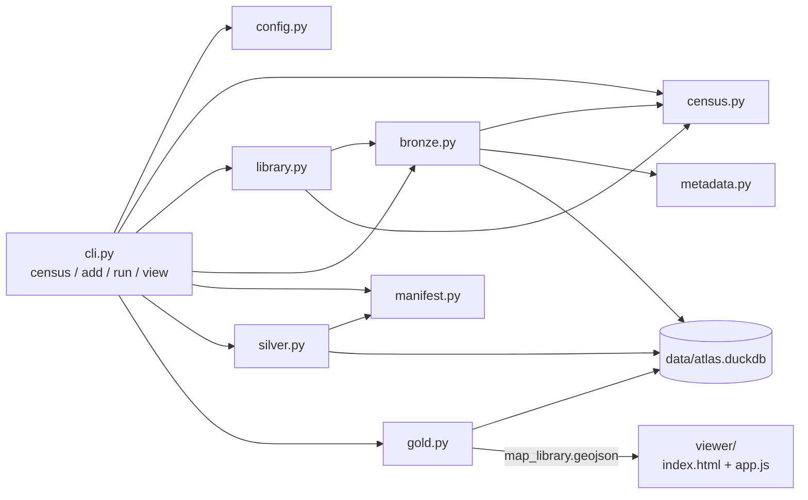

# Developer guide

The granular reference: exactly what each module does, the table schemas, the rules, and
where the sharp edges are. For the plain-language tour read
[HOW_IT_WORKS.md](HOW_IT_WORKS.md) first; to just add maps, see
[QUICKSTART.md](QUICKSTART.md). The plan is in
[../PROJECT_SCOPE.md](../PROJECT_SCOPE.md); section 11 below lists what changed from its
first version.

Last updated: 7 October 2026.

---

## 1. Stack

| Piece | Choice | Used for |
|---|---|---|
| Language | Python 3.11+ (3.12 in use) | Everything in `src/atlas/` |
| Storage | DuckDB, one file: `data/atlas.duckdb` | The bronze, silver and gold tables |
| Raster reading | rasterio (bundles GDAL and PROJ) | Image headers; coordinate conversion |
| PDF reading | pypdf | Page count, title, geospatial viewports |
| Config | PyYAML | `config.yaml` |
| Viewer | MapLibre GL JS 5.6.0 from the unpkg CDN | Globe, boxes, pop-up |
| Base map | OpenStreetMap raster tiles | Background imagery, no API key |
| Tests | pytest | 45 tests in `tests/` |

Not installed, although named in the plan: standalone GDAL (`osgeo`), pyproj, shapely.
rasterio covers reprojection, and a bounding-box polygon is built by hand in `gold.py`.

rasterio's bundled GDAL lists a PDF driver but cannot *read* PDFs, which is why PDF
georeferencing is parsed with pypdf.

---

## 2. Module map



Arrows mean "uses". `bronze.py` and `library.py` reuse `census.py` only for the folder
walk and the list of accepted extensions; `library.py` reuses `bronze.hash_file`.

| Module | Responsibility |
|---|---|
| `cli.py` | Argument parsing and the order of operations. No business logic. |
| `config.py` | Loads `config.yaml`; one helper per setting, each with a default. |
| `census.py` | Read-only folder report. Standalone; writes nothing. |
| `metadata.py` | Reads raw metadata from inside one file. Never raises. |
| `library.py` | `atlas add`: copies maps into the library and maintains `library/index.csv`. |
| `bronze.py` | Library scan, hashing, `bronze.file_inventory`, CSV export. |
| `manifest.py` | Reads and maintains the two hand-edited CSVs. |
| `silver.py` | Bbox resolution, validation, `silver.maps`, CSV export. |
| `gold.py` | `gold.map_library`, `gold.needs_review`, GeoJSON and CSV export. |

---

## 3. What `atlas run` does, in order

Defined in `cli.main`.

1. `load_config` reads `config.yaml`.
2. `bronze.build_inventory(library_dir, data/atlas.duckdb, original_names)` scans the
   library, upserts, and deletes rows for files no longer there.
3. `bronze.export_csv` writes `data/bronze/file_inventory.csv`.
4. `manifest.ensure_manifest` adds missing columns, then blank rows for unseen file names.
5. The manifest and regions files are copied as-is to `data/bronze/manual_inputs/`.
6. `silver.build_silver` rebuilds `silver.maps` from bronze plus the manual inputs.
7. `silver.export_csv` writes `data/silver/maps.csv`.
8. `gold.build_gold` rebuilds both gold tables and writes the two gold files.

`atlas add` is a separate command and is the only thing that writes to `library/`.

Bronze is incremental. Silver and gold are dropped and rebuilt in full on every run
(`CREATE OR REPLACE TABLE`), so they are always a pure function of bronze plus the
manual inputs.

---

## 4. Commands and flags

| Command | Flags | Notes |
|---|---|---|
| `atlas census` | `--folder PATH`, `-v/--verbose`, `--json` | `--folder` overrides `maps_folder` and needs no config file. |
| `atlas add PATH...` | none | Files or folders (recursive). Exit code 2 if any path does not exist. |
| `atlas run` | none | Needs `config.yaml`. Creates `library_dir` if absent. |
| `atlas view` | `--port N` (default 8000), `--no-browser` | Serves the current directory on `127.0.0.1` only. Must be run from the project root. |
| all | `--config PATH` (before the subcommand) | Default `config.yaml` in the current directory. |

Exit code 2 on a missing config, a missing maps folder, or a port that is in use.

### `config.yaml` keys

| Key | Default | Meaning |
|---|---|---|
| `library_dir` | `library` | The flat folder of copies that the pipeline reads. |
| `maps_folder` | none | Only the default folder for `atlas census`. Optional. |
| `data_dir` | `data` | Where the database and exports go. |
| `regions_csv` | `config/regions.csv` | Region definitions. |
| `manifest_csv` | `config/map_manifest.csv` | Per-map manual input. |
| `use_embedded_location` | `false` | If `true`, in-file georeferencing fills in when the manifest gives no box. |

Relative paths resolve against the directory the command is run from.

---

## 5. Census (`census.py`)

- `iter_files` walks with `os.walk`, sorted, skipping any file or directory whose name
  starts with `.`. Symlinked directories are not followed.
- `MAP_EXTENSIONS`: `.pdf`, `.tif`, `.tiff`, `.jpg`, `.jpeg`, `.png` (case-insensitive).
- PDFs: a page counts as geospatial if it has `/LGIDict` (the older TerraGo style) or a
  `/VP` viewport whose `/Measure` has `/Subtype /GEO` (the ISO 32000 style).
- Rasters: opened with rasterio (header only). A TIFF with a CRS, GCPs, or a non-identity
  transform and no sidecar is `geotiff`/`embedded`. A sidecar world file (`.tfw`, `.jgw`,
  `.pgw`, `.wld` and variants) gives `worldfile`.
- Unreadable files become a record with `status: error`; they are counted, not dropped.
- Other extensions are tallied under "ignored", excluding world files.

The census has its own inspection code and does not share it with `metadata.py`. They
agree today; a change to PDF detection needs making in both.

---

## 5b. Library (`library.py`)

`add_maps(sources, library_dir)`:

1. Reads `library/index.csv` and drops index rows whose copy is no longer on disk.
2. Collects candidate files: each source is a file or a directory walked with
   `iter_files`. Non-map extensions are counted and skipped; anything already inside the
   library is ignored; paths that do not exist are reported.
3. Hashes each candidate. If the SHA-256 is already present, it is skipped. Otherwise it
   is copied with `shutil.copy2` (which keeps the file's own modified date) to
   `<stem, max 150 chars>__<first 10 hex of the hash><lower-case suffix>`.
4. Rewrites `index.csv`.

`index.csv` columns: `file_id, library_name, original_name, original_path, added_at`.
`original_path` is kept so the source folder names can later be used to suggest labels.

De-duplication is by content, so the same map under two names is stored once (first name
wins). The index is a convenience, not the source of truth for what exists: a file dropped
straight into `library/` is still picked up by bronze, under its own name. If the index is
lost, files keep their library names as `file_name`.

Renaming a file inside the library makes bronze treat it as a new path, and breaks its
link to the index.

---

## 6. Bronze (`bronze.py`, `metadata.py`)

### Table `bronze.file_inventory`

| Column | Type | Notes |
|---|---|---|
| `file_id` | VARCHAR | SHA-256 of the file's bytes, hex. Not unique: exact copies share it. |
| `file_path` | VARCHAR, **primary key** | Absolute, resolved path of the library copy. |
| `file_name` | VARCHAR | Original name from `library/index.csv`; the library name if not indexed. |
| `extension` | VARCHAR | Lower-case, no dot. |
| `size_bytes` | BIGINT | |
| `modified_at` | TIMESTAMP | UTC, from the file's mtime. |
| `ingested_at` | TIMESTAMP | UTC. Set when the row is inserted or its file changes. |
| `raw_metadata` | JSON | See below. |

### Incremental behaviour

For each file: if a row exists for the same path with the same `size_bytes` and
`modified_at`, the file is **not** re-hashed and counts as `unchanged`. Otherwise it is
hashed in 1 MB chunks and written with `INSERT OR REPLACE`, counting as `new` or `changed`.

- The table mirrors the library: rows whose file is gone are deleted and counted
  (`removed`).
- A row whose `raw_metadata` is NULL (written by an early version) has it filled in on
  the next run without re-hashing.
- Skipping relies on size and mtime, so an edit that preserves both would be missed.

### `raw_metadata` shapes

PDF (`reader: "pypdf"`):

```json
{
  "reader": "pypdf",
  "pages": 2,
  "title": "Bedrock Geology of Wisconsin",
  "has_lgidict": false,
  "geo_viewports": [
    {
      "page": 0,
      "bbox": [57.0, 787.0, 597.0, 39.0],
      "gpts": [40.83, -92.99, 47.35, -93.34, 47.34, -86.41, 40.82, -86.78],
      "epsg": null,
      "wkt": "PROJCS[...]"
    }
  ]
}
```

`bbox` is the viewport's rectangle on the page in points. `gpts` is latitude/longitude
pairs for its corners, on the map's own datum.

Raster (`reader: "rasterio"`): `driver`, `width`, `height`, `crs` (WKT or null),
`has_transform`, `bounds`.

Any failure: `{"error": "ExceptionType: message"}`. `read_raw_metadata` never raises, so
one bad file cannot stop a run.

### CSV export

`data/bronze/file_inventory.csv` has the same columns. Timestamps are converted to local
time and trimmed to the minute for readability, so the CSV is not a byte-exact dump.

---

## 7. Manual inputs (`manifest.py`)

### `config/map_manifest.csv`

Columns: `file_name, revisit, region_key, min_lon, min_lat, max_lon, max_lat, title, notes`.

- **Join key is `file_name`** (the original name). Not the path, not the hash.
- `ensure_manifest` appends a blank row for every inventory file name not present. New
  rows are sorted among themselves and added at the end.
- `_add_missing_columns` rewrites the file once if a column from `COLUMNS` is absent,
  preserving every cell and any extra columns the user added.
- Existing cells are never modified.
- Read with `utf-8-sig` (tolerates the byte-order mark spreadsheet apps add); header
  names and values are stripped of surrounding spaces.
- If a file name appears twice, the last row wins.
- `revisit` is "on" for any value except blank, `no`, `n`, `false`, `0`.

### `config/regions.csv`

Columns: `region_key, region_name, min_lon, min_lat, max_lon, max_lat`. Keys are matched
case-insensitively. Committed to the repository.

Ships with 58 rows: 50 states, DC, 5 territories, `contiguous_united_states` and
`united_states`. State boxes are from
https://gist.github.com/a8dx/2340f9527af64f8ef8439366de981168 (columns `STATEFP`,
`STUSPS`, `NAME`, `xmin`, `ymin`, `xmax`, `ymax`; it appears to be derived from US Census
boundary files). Changes made when importing:

- Keys are the name lower-cased with underscores. Two long names were shortened:
  "Northern Mariana Islands" and "US Virgin Islands".
- **Alaska's `max_lon` was changed from 179.77847 to -129.97.** The source box spans the
  antimeridian and would fail validation (wider than 180 degrees). The replacement is an
  approximate eastern limit of the state, entered by hand; Aleutian islands west of 180
  degrees are outside the box.
- The two country rows are computed: the min/max over the lower 48 plus DC, and over all
  50 states plus DC (with the adjusted Alaska). Territories are not included in either.

`tests/test_regions.py` checks the shipped file: row count, every box valid, and the
country boxes containing their states.

---

## 8. Silver (`silver.py`)

### Table `silver.maps`

One row per bronze row.

| Column | Type | Values |
|---|---|---|
| `map_id` | VARCHAR | Equal to `file_id`. |
| `title` | VARCHAR | Manifest `title`, else `clean_title(file_name)`. |
| `format` | VARCHAR | `geopdf`, `pdf`, `geotiff`, `tiff`, `jpg`, `png`. |
| `width_px`, `height_px` | INTEGER | Rasters only. |
| `is_georeferenced` | BOOLEAN | Whether the file carries georeferencing. |
| `georef_method` | VARCHAR | `embedded` or `none`. |
| `region_key` | VARCHAR | From the manifest, lower-cased. Several keys are stored as `a; b; c`. |
| `bbox_source` | VARCHAR | `manual_override`, `embedded`, `region_default`, `none`. |
| `bbox_precision` | VARCHAR | `exact` or `approximate`; NULL without a box. |
| `source_crs` | VARCHAR | `EPSG:n` if recognised, else WKT. Only for files with georeferencing. |
| `min_lon`, `min_lat`, `max_lon`, `max_lat` | DOUBLE | WGS84, rounded to 6 decimals. |
| `status` | VARCHAR | `ok`, `needs_georef`, `error`. |
| `status_detail` | VARCHAR | Reason or label. |
| `duplicate_of` | VARCHAR | Always NULL for now. |

`is_georeferenced` and `georef_method` describe the file. `bbox_source` describes where
the box actually came from. With `use_embedded_location: false` a GeoPDF can be
`is_georeferenced = true` with `bbox_source = region_default`.

### Resolution order (`resolve_map`)

1. If bronze recorded a read error, stop: `status = error`.
2. Manifest box, if all four cells are filled → `manual_override`, `exact`.
3. Embedded georeferencing, **only if** `use_embedded_location` is true → `embedded`, `exact`.
4. Region box via `region_key` → `region_default`, `approximate`. The cell may hold several
   keys separated by `;`; the box is the min/max over all of them. Any unknown key is an error.
5. Otherwise `needs_georef`.

Then `_validate` runs on whatever box was chosen. A failure sets `status = error` and
keeps the offending numbers in the row.

### Validation rules

- All four values finite.
- Latitudes within [-90, 90]; longitudes within [-180, 180].
- `min_lon < max_lon` and `min_lat < max_lat`.
- Width over 180 degrees is flagged as a possible antimeridian crossing, not fixed.

Manifest-specific errors: a partly filled box, a non-numeric value, a `region_key` not
in `regions.csv`, a region with no box.

### Revisit mark

If `revisit` is on, `status_detail` starts with `marked to come back to` (plus
`: <notes>` when notes exist). It does not change the status: a marked map with a box is
`ok`, one without is `needs_georef`. `build_silver` counts marked rows by that prefix.

### Embedded georeferencing (present, off by default)

- PDFs: `_main_viewport` picks the largest viewport by page area on the first page that
  has any. `bbox_from_pdf_viewport` builds the CRS from the viewport's EPSG code or WKT,
  projects the four corner points into the map's projection, adds 21 points along each
  edge (`DENSIFY_POINTS`), converts to EPSG:4326 and takes the min and max. Densifying
  matters because a straight edge in a projected map is curved in latitude/longitude.
- Rasters with a CRS and a transform: `rasterio.warp.transform_bounds` with
  `densify_pts=21`.
- The embedded box is computed on every run regardless of the switch, so the file facts
  (`format`, `is_georeferenced`, `source_crs`) are always filled in.

Not handled: `/LGIDict` GeoPDFs (flagged in `status_detail`), and world files, which
carry no coordinate system.

---

## 9. Gold (`gold.py`)

Built with two `CREATE OR REPLACE TABLE ... AS SELECT DISTINCT` statements joining
`silver.maps` to `bronze.file_inventory` on `map_id = file_id`.

| Table | Rows | Columns |
|---|---|---|
| `gold.map_library` | `status = 'ok'` | `map_id, title, file_path, min_lon, min_lat, max_lon, max_lat` |
| `gold.needs_review` | `status <> 'ok'` | `map_id, title, file_path, status, status_detail` |

Exports:

- `data/gold/map_library.geojson`: a FeatureCollection. Each feature has properties
  `title` and `file_path` only, and a Polygon whose ring runs counter-clockwise from the
  south-west corner and closes on itself.
- `data/gold/needs_review.csv`: `title, file_path, status, status_detail`.

There is no geometry column in the table; the polygon is built at export time from the
four numbers.

---

## 10. Viewer (`viewer/`)

Static files, no build step. `atlas view` serves the project root with Python's built-in
web server so the page can fetch `../data/gold/map_library.geojson`. Opening
`index.html` directly from disk will not work, because browsers block that fetch.

`app.js`:

- Style is defined inline: one OpenStreetMap raster source, `projection: globe`.
- On load it fetches the GeoJSON with caching disabled, and keeps `title`, `file_path`
  and a `[west, south, east, north]` array per map in memory.
- **Drawing.** Features are de-duplicated by identical geometry before being added, so
  24 maps sharing one box draw one fill (10% opacity) and one outline instead of 24
  stacked fills.
- **Clicking.** `mapsAt` does a plain number comparison of the clicked point against
  every box. It does not query rendered features, so the list is complete and includes
  maps whose box was de-duplicated away. No matches means no pop-up.
- **Pop-up.** Built with DOM nodes and `textContent`, so titles and paths cannot inject
  HTML. The list is capped at 260 px tall and scrolls.
- The view is fitted to all boxes on load, capped at zoom 9.

The point-in-box test compares longitudes directly, so a box crossing the antimeridian
would not work. Silver flags such boxes as errors, so none reach the viewer.

---

## 11. Changes from the original plan

| Original plan | What the code does | Why |
|---|---|---|
| Resolution: manual, embedded, region, none | Embedded is skipped unless `use_embedded_location: true` | The owner chose to assign every box by hand. |
| `raw_metadata` = `gdalinfo -json` | JSON from pypdf or rasterio | Standalone GDAL is not installed. |
| Manifest columns per section 5.5 | Adds `revisit` | To park maps for later. |
| Gold has `format`, `geometry`, `area_km2` | Only `map_id`, `title`, `file_path` and the four numbers | The owner asked for a minimal file. |
| Gold carries `bbox_source` / `bbox_precision` | Not carried | Same. The viewer cannot style approximate boxes differently yet. |
| Title from PDF metadata, else file name | Manifest title, else file name | Embedded PDF titles were unreliable. They are still stored in `raw_metadata`. |
| `format` values exclude `tiff` | A TIFF without georeferencing is `tiff` | Nothing else fits. Untested on real data. |
| pyproj, shapely | Not used | rasterio covers reprojection; polygons are trivial. |
| Scan `maps_folder` in place | Maps are copied into a flat `library/`; bronze scans that | Decouples the atlas from the owner's folder structure. |
| Bronze: "nothing lost", rows kept | Bronze mirrors the library; rows for missing files are deleted | Otherwise removed maps stayed on the globe. |

`PROJECT_SCOPE.md` and `CLAUDE.md` have been updated to describe the code as built; this table is the record of what changed from the first version of the plan.

---

## 12. Known limitations

- **Manifest joins on file name.** Two different maps with the same original name are
  kept apart in the library and in bronze, but share one manifest row.
- **Disk use doubles.** The library is a full copy.
- **Multi-region boxes can cross the antimeridian.** Combining, say, Guam with a mainland
  state gives a box wider than 180 degrees, which is flagged as an error.
- **Region boxes are rectangles around irregular shapes.** `united_states` covers most
  of Canada and a large part of the Pacific.
- **Duplicates.** Exact copies share a `file_id`, hence a `map_id`. `duplicate_of` is
  never set, the silver CSV export shows one file name per `map_id`, and gold emits one
  row per distinct path. Untested on real data; the test folder has no duplicates.
- **Multi-page PDFs are one map.** Only the first georeferenced page is considered.
- **Change detection is size plus mtime.**
- **Census and metadata duplicate PDF detection logic.**
- **Scale.** Only run on 26 files. Silver recomputes embedded boxes for every file on
  every run, which is cheap now and may not be at thousands of files.
- **Viewer needs internet** for the base map and the MapLibre library.

---

## 13. Tests

```bash
.venv/bin/pytest
```

All fixtures are generated in temporary folders; no real maps are needed or touched.

| File | Tests | Covers |
|---|---|---|
| `test_census.py` | 10 | Classification of each format, summary counts, error handling, read-only guarantee, CLI. |
| `test_library.py` | 6 | Flat copy, same-name maps kept apart, same-content maps stored once, re-adding, index contents, originals untouched, CLI. |
| `test_bronze.py` | 10 | Inventory, duplicate hashes, incremental re-runs and removals, original names, CSV export, manifest row and column maintenance, reading spreadsheet-saved CSVs, CLI. |
| `test_regions.py` | 3 | The shipped place list: count, validity, country boxes contain their states. |
| `test_silver.py` | 15 | Manual box, region default, precedence, the embedded switch, densification, inset viewports, manifest mistakes, revisit mark, validation. |
| `test_gold.py` | 1 | GeoJSON contents, to-do list, re-runnability. |

The viewer has no automated tests; it was checked by hand in a browser.

---

## 14. Setup and repository notes

```bash
python3 -m venv .venv
```

```bash
.venv/bin/pip install --only-binary rasterio -e ".[dev]"
```

`--only-binary rasterio` matters: without it pip may pick a rasterio release that has no
prebuilt package for this macOS version and try to compile it, which fails without GDAL.

Never commit (all in `.gitignore`): `library/`, `data/`, `config.yaml`, `config/map_manifest.csv`,
and map files (`*.pdf`, `*.tif`, `*.tiff`, `*.jpg`, `*.jpeg`, `*.png`, world files).

### Inspecting the database directly

```bash
.venv/bin/python -c "import duckdb; print(duckdb.connect('data/atlas.duckdb', read_only=True).sql('select status, bbox_source, count(*) from silver.maps group by all'))"
```
