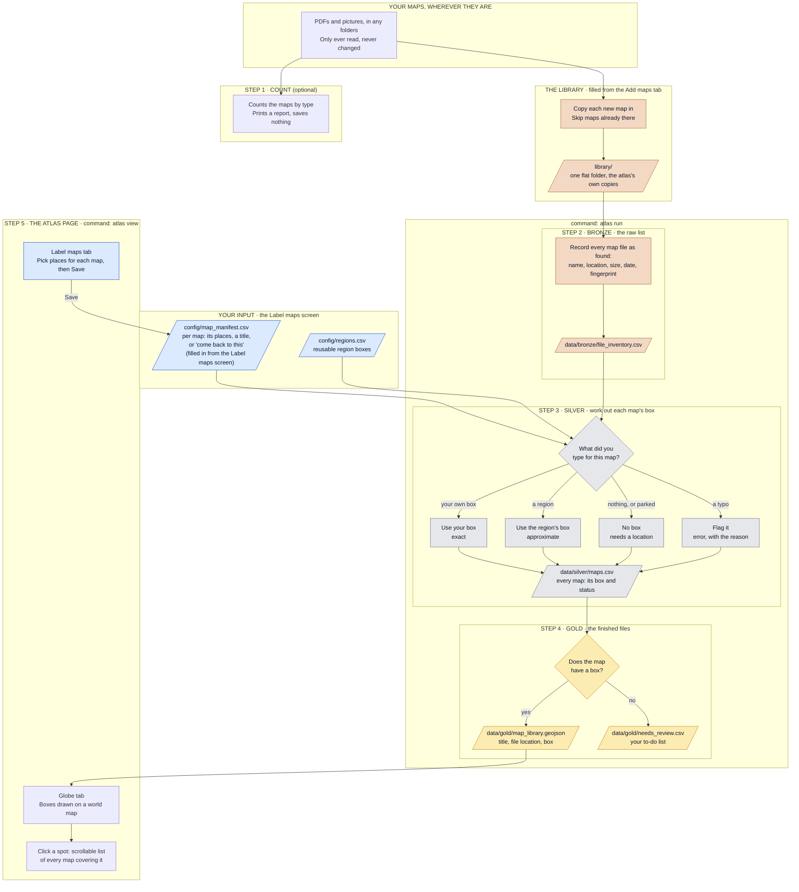

# How Map Library Atlas works

A plain-language walkthrough of the whole thing, from your folder of maps to the globe
in your browser. Written so you can come back after a break and follow it top to bottom.

Just want to add maps? See [QUICKSTART.md](QUICKSTART.md). Want the technical detail?
See [DEVELOPER.md](DEVELOPER.md).

Last updated: 7 October 2026.

---

## 1. What this is

You have a folder of maps (PDFs and pictures). A folder view can't tell you *where* those
maps cover. This project builds an index: it lists every map, attaches a rectangle
("bounding box") saying what part of the world each one covers, and draws those rectangles
on a globe. Click a spot on the globe and you get a list of every map covering that spot.

It runs entirely on your own computer. Your original map files are only ever **read**:
never changed, moved or renamed. The atlas keeps its own copy of each map in one folder
called the library.

Right now the library holds one small test set (26 Wisconsin maps), not your whole collection.

---

## Two words used throughout

- **Places** are tags. They say where a map is (Wisconsin, Minnesota), so it can be found
  and, later, filtered. A map can have several.
- **Footprint** is the shape drawn for a map on the globe. Today a footprint is always a
  rectangle. The long-term aim is for it to be the map's true outline, which is a much
  harder problem and is deliberately left for later. The guides say "footprint" for the
  shape and "box" only for the four numbers that currently define it.

A map's places and its footprint are chosen separately. A county map can be tagged
Wisconsin without being drawn as a statewide rectangle.

---

## 2. The big picture



**How to read it.** Follow the arrows from top to bottom. Each outlined area is one stage.
Slanted boxes are files, diamonds are decisions, plain boxes are actions. Blue is what you
edit; the bronze, grey and gold tints match the three layers.

If you see code above instead of a drawing, your viewer doesn't draw Mermaid diagrams.
It draws automatically on GitHub and in the VS Code preview, or you can paste the code
into https://mermaid.live. The same flow in plain text:

```
 Your maps, in any folders  ->  1. Count (optional report)
        |
        v
 LIBRARY     the atlas's own copy of every map, in one flat folder (Add maps tab)
        |
        v
 2. BRONZE   the raw list of map files
        |    <--- your labels (from the Label maps screen) and the list of places
        v
 3. SILVER   each map's box, or the reason it has none
        |
        v
 4. GOLD     maps for the globe  +  your to-do list
        |
        v
 5. THE ATLAS PAGE   Globe tab, and a Label maps tab that saves your labels
                     back in above silver
```

Maps get into the library from the **Add maps** tab. Steps 2, 3 and 4 then run by
themselves: whenever you open the atlas, add maps, or save labels.

"Bronze, silver, gold" is just a naming habit for data that gets more refined at each
stage: bronze is raw, silver is cleaned up, gold is ready to use.

---

## 3. The one rule to remember

| Folder | Whose is it? | What that means |
|---|---|---|
| `config/` | **Yours** | Your labels and the list of places. You normally change labels on the **Label maps** screen, which writes them here for you. |
| `library/` | **The tool's** | The atlas's copies of your maps. Filled from the Add maps tab. Don't rename files in it. |
| `data/` | **The tool's** | Rebuilt from scratch on every run. Anything you type here is wiped. |

To change something about a map (its places, its title, whether it's parked), open the
atlas, go to **Label maps**, make the change and click **Save**. The globe updates
straight away. 

---

## 4. The four commands

Run these in a terminal, from the project folder.

| Command | What it does | Does it change anything? |
|---|---|---|
| `.venv/bin/atlas census -v` | Counts the maps in a folder by type and prints the list. | No. It only prints. |
| `.venv/bin/atlas add <file or folder>` | Copies maps into the library. The **Add maps** tab does the same thing without the terminal. | Adds files to `library/`. Your originals are untouched. |
| `.venv/bin/atlas run` | Rebuilds bronze, silver and gold from the library and your labels. | Rewrites everything in `data/`. Adds blank rows to your labels file for new maps. |
| `.venv/bin/atlas view` | Rebuilds, then opens the atlas page (Globe, Label maps, Add maps) in your browser. | Rewrites `data/`. Saving on the Label maps screen updates your labels file. Press Ctrl+C in the terminal to stop it. |

Typical session: `atlas view`, drop new maps on the **Add maps** tab, label them on the
**Label maps** tab, click Save. That is the only command you need; `atlas add` and
`atlas run` still exist but the page does both jobs for you.

---

## 5. Each step in detail

### Step 1: Count (the "census")

**What it does.** Walks through a folder you point it at, including sub-folders, and counts
the files that look like maps: `.pdf`, `.jpg`/`.jpeg`, `.png`, `.tif`/`.tiff`. Hidden files and
other file types are ignored (other types are mentioned at the bottom of the report).

**What it tells you.** How many maps of each type, how many PDFs have more than one page,
and how many files have their location stored inside them. Some PDFs made by mapping
software carry their own coordinates; the report calls these `geopdf`.

**What it found in the test folder.** 26 maps: 22 PDFs (16 of them with location stored
inside), 3 JPGs and 1 PNG. None were unreadable.

**Where the result goes.** Nowhere. It is printed on screen and not saved. It is a way to
size up a folder before adding it; you never have to run it.

### The library (staging your maps)

**What it is.** One flat folder, `library/`, holding the atlas's own copy of every map.
Think of it as the staging area: maps can live anywhere on your computer, in any folder
structure, and nothing reaches the atlas until you add it here.

**Adding maps.** On the **Add maps** tab you drop in a file, several files, or a whole
folder (sub-folders included). The `atlas add` command does the same from the terminal.
For each map, the atlas works out the fingerprint and:

- if a map with that fingerprint is already in the library, skips it;
- otherwise copies it in.

Your originals are only read. You can add the same folder again and again; only maps the
library doesn't have yet are copied.

**How copies are named.** The original name, two underscores, then the first ten
characters of the fingerprint: `Wisconsin_map.jpg` becomes `Wisconsin_map__1a2b3c4d5e.jpg`.
That keeps names readable while making sure two different maps both called `map.pdf`
cannot overwrite each other.

**`library/index.csv`.** A record kept by the tool, one row per map: its fingerprint, its
name in the library, its original name, the folder it was copied from, and when.

**Removing a map.** Delete its file from `library/` and run `atlas run`. It drops off the
list and the globe.

### Step 2: Bronze (the list)

**What it does.** Writes down one row per map in the library, exactly as found, with no
judgement. The list always mirrors the library: a map removed from the library is removed
from the list.

**How.** For each map file it records its original name, where its library copy lives, its size and the date it
was last changed. It also works out a **fingerprint**: a long code calculated from the
file's contents. Two files with the same fingerprint are exact copies of each other, and
if a file's contents change, its fingerprint changes.

It also saves whatever technical details are stored inside the file (for example the
location details inside those 16 PDFs). These are kept for reference; see section 7 for
why they are not currently used.

**Skipping unchanged files.** On later runs, a file whose size and date haven't changed
is not fingerprinted again. That is why a second run reports `unchanged: 26`.

**Output:** `data/bronze/file_inventory.csv`

| Column | Meaning |
|---|---|
| `file_id` | The fingerprint. |
| `file_path` | Full location of the atlas's copy, inside `library/`. |
| `file_name` | The name the map had before it was added. |
| `extension` | File type: `pdf`, `jpg`, `png`. |
| `size_bytes` | Size in bytes (1,000,000 is about 1 MB). |
| `modified_at` | When the file was last changed (your local time). |
| `ingested_at` | When the tool first recorded this file, or last saw it change. |
| `raw_metadata` | Technical details read from inside the file. Long and not meant for reading. |

Bronze also keeps a copy of your two hand-edited files, exactly as they were at the time
of the run, in `data/bronze/manual_inputs/`. That way there is a record of what your notes
said when each run happened.

### Between bronze and silver: your labels

This is where you come in. You label maps on the **Label maps** screen (see step 5).
Behind it is one file, **`config/map_manifest.csv`**, with one row per map. The screen
writes your choices there when you click Save. The tool adds a blank row whenever it sees
a new map, and never changes a label by itself. You can still open and edit the file by
hand if you ever want to.

| Column | What you type |
|---|---|
| `file_id` | The map's fingerprint, filled in by the tool. Leave it alone; it is how a row is matched to its map. |
| `file_name` | The map's original file name, filled in by the tool, so you can tell rows apart. |
| `revisit` | `yes` to park this map as "come back to this later". Blank otherwise. |
| `region_key` | The map's places (tags), e.g. `wisconsin`. Several are separated by semicolons: `new_york; connecticut; new_jersey`. |
| `footprint` | How the footprint is decided: `places` (a rectangle around its places), `own` (its own rectangle, from the four numbers below), or `none` (tagged only, nothing drawn yet). Blank on older rows means "own if the four numbers are filled, otherwise places". |
| `min_lon`, `min_lat`, `max_lon`, `max_lat` | The map's own rectangle: west, south, east and north edges, in degrees. Fill in all four or none. |
| `title` | A nicer name for the map. Blank means "use the tidied-up file name". |
| `notes` | Anything you like. Shown next to parked maps. |

Tips: longitudes in the US are negative. If you edit in Numbers, use File > Export To >
CSV; a normal save produces a file the tool cannot read.

**`config/regions.csv`** is the list of places a map can be labelled with. Each row is a
short key, a name, and the four edges of the place's box. It comes filled in with:

- all 50 US states and the District of Columbia;
- five US territories (American Samoa, Guam, Northern Mariana Islands, Puerto Rico,
  US Virgin Islands);
- `contiguous_united_states` (the lower 48) and `united_states` (all 50 states), for
  national maps.

Keys are the name in lower case with underscores: `wisconsin`, `new_york`,
`district_of_columbia`. You can add your own rows (a county, a city, another country).

The state boxes came from a public list of US state bounding boxes
(https://gist.github.com/a8dx/2340f9527af64f8ef8439366de981168). One was adjusted:
Alaska's islands cross the line on the far side of the world where longitude flips from
-180 to +180, which made its box wrap around the whole globe. Its box here stops at that
line, so a few of the westernmost Aleutian Islands fall outside it.

### Step 3: Silver (working out each map's box)

**What it does.** Combines the bronze list with your notes and decides, for every map,
what its box is, or why it doesn't have one.

**How it decides.** It looks at the footprint choice you made for the map:

| Your choice | What happens |
|---|---|
| **A rectangle around its places** | One rectangle is drawn around all of the map's places. Marked `region_default`, `approximate`. With no places, there is nothing to draw. |
| **Its own rectangle** | The four numbers you entered are used. Marked `manual_override`, `exact`. Until you enter them, nothing is drawn. |
| **None yet** | Nothing is drawn. The map keeps its places as tags and stays on the "not on the globe" list. |

A map with no footprint is marked `needs_georef` ("needs a location").

**Parked maps.** A map with `yes` in `revisit` gets the label "marked to come back to"
plus your note. If it has no box, it stays on the needs-a-location list. If you also gave
it a region or box as a placeholder, it gets that box and keeps the label.

**Typos are caught, not hidden.** A map is marked `error`, with the reason spelled out,
when: only some of the four box numbers are filled in; a value isn't a number; the region
isn't in `regions.csv`; south is above north or west is right of east; or a number is
outside the possible range for latitude or longitude.

**Titles.** Your `title` if you typed one. Otherwise the file name with underscores and
dashes turned into spaces (`Wisconsin_map.jpg` becomes "Wisconsin map").

**Output:** `data/silver/maps.csv`

| Column | Meaning |
|---|---|
| `file_name` | The file's name (added to this spreadsheet for readability). |
| `map_id` | The map's ID. Same as its fingerprint. |
| `title` | The title, as described above. |
| `format` | `geopdf` (PDF with location inside), `pdf`, `jpg` or `png`. |
| `width_px`, `height_px` | Picture size in pixels. Filled for images, blank for PDFs. |
| `is_georeferenced`, `georef_method` | Whether the *file itself* carries a location. A fact about the file, not about the box. |
| `region_key` | The map's places (tags), whether or not they are used for its footprint. |
| `bbox_source` | Where the box came from: `manual_override`, `region_default` or `none`. |
| `bbox_precision` | `exact` (your own box) or `approximate` (a region box). |
| `source_crs` | Technical description of the coordinate system inside the file, where there is one. Safe to ignore. |
| `min_lon`, `min_lat`, `max_lon`, `max_lat` | The box: west, south, east, north. |
| `status` | `ok` (has a box), `needs_georef` (needs a location) or `error` (something is wrong). |
| `status_detail` | The reason or label in plain words. |
| `duplicate_of` | Reserved for marking exact copies. Not filled in yet. |

**Test folder result:** 24 maps `ok` with the Wisconsin box, 2 parked.

### Step 4: Gold (the finished files)

**What it does.** Splits silver into the two things you actually use.

**`data/gold/map_library.geojson`**: the maps that have a box. This is the file the globe
reads. It is plain text and can be opened in any text editor. For each map it holds only:

- `title`
- `file_path` (where the file lives)
- the four corners of its box

**`data/gold/needs_review.csv`**: your to-do list. Every map that is *not* `ok`, with
columns `title`, `file_path`, `status` and `status_detail`. Parked maps and typos both
show up here.

### Step 5: The atlas page

`atlas view` first rebuilds everything, so what you see is always current, then opens one
page in your browser with three tabs.

#### Globe tab

A world map you can drag, zoom, and zoom out into a globe, with your boxes drawn in orange.

**Clicking.** Click anywhere and the atlas checks which maps' boxes contain that spot.
If there are any, a pop-up lists all of them: title on top, file location in small text
underneath. The list scrolls when it is long. Click where there are no maps and nothing
happens. The lines are not clickable; they tell you where to find the file.

**Identical boxes.** Maps sharing the exact same box are drawn as one rectangle so they
don't stack into a solid block. The pop-up still lists every one of them.

#### Label maps tab

One card per map in the library. Each card has:

- **A preview** of the map. Click it to open the map itself in a new browser tab.
- **A badge:** "On the globe", "Needs a place", "Tagged · no footprint yet", "Parked", or "Problem".
- **Title.** Leave it empty to use the tidied-up file name, shown in grey.
- **Places this map is in (tags).** Start typing a state and pick it from the list. Add
  as many as apply. Click the × on a place to remove it.
- **Footprint on the globe.** A rectangle around its places (the usual choice), its own
  rectangle (four boxes appear for the west, south, east and north edges), or none yet.
- **Come back to this one,** with room for a note to yourself.

Across the top: buttons to show all maps, only those not on the globe, or only those you
parked; a list to show only the maps tagged with one place (or with no places yet); a
search box; and **Save**.

**Saving.** Cards you have changed get an orange outline and the top bar counts them.
Nothing is stored until you click **Save**. Save writes your labels to
`config/map_manifest.csv`, rebuilds silver and gold, and redraws the globe. If you try to
close the page with unsaved changes, the browser asks first.

**Previews.** Made the first time each map is shown, using the preview feature built into
macOS, then kept in `data/thumbnails/`. The first visit is slow (a second or two per
map); after that they appear at once.

#### Add maps tab

A box to drop map files or a folder into, plus "Choose files" and "Choose a folder"
buttons that do the same thing.

- Each map is copied into the library. Your originals are not changed or moved.
- The page lists every file with what happened: added, already in the library, or
  could not be added. Files that are not maps are counted and skipped.
- **New maps arrive with no places and no footprint.** Nothing is guessed from folder or
  file names, on purpose: labelling is a manual check you do yourself.
- When it finishes, "Label the new maps" takes you to the Label maps tab showing the
  maps that are not on the globe yet.

Label changes you have typed but not saved are kept when you add maps.

**Good to know.**
- The background map comes from OpenStreetMap. It is free and needs no account, but it
  does need an internet connection.
- The atlas page is only reachable from your own computer.
- The search box finds maps by file name, title or place.

---

## 6. Where everything is

```
map-library-atlas/
├── README.md                    Short intro and setup commands
├── PROJECT_SCOPE.md             The project plan, kept up to date with what was built
├── CLAUDE.md                    Working rules for Claude sessions
├── config.example.yaml          Template for settings (safe to share)
├── config.yaml                  YOUR settings: where your maps folder is (private)
├── pyproject.toml               Lists the software libraries the tool needs
│
├── config/                      ── YOURS TO EDIT ──
│   ├── map_manifest.csv         Your labels: one row per map, written by the Label maps screen (private)
│   ├── map_manifest.example.csv A made-up example of the labels file (safe to share)
│   └── regions.csv              The list of places you can label a map with, and their boxes
│
├── library/                     ── THE ATLAS'S COPIES OF YOUR MAPS (private) ──
│   ├── <name>__<fingerprint>.pdf  One file per map, all in this one folder
│   └── index.csv                Where each map came from and when it was added
│
├── data/                        ── MADE BY THE TOOL, rebuilt every run (private) ──
│   ├── atlas.duckdb             A small database holding all three layers
│   ├── bronze/
│   │   ├── file_inventory.csv   The list of map files
│   │   └── manual_inputs/       Copies of your notes and regions as of the last run
│   ├── silver/
│   │   └── maps.csv             Every map with its box and status
│   ├── gold/
│   │   ├── map_library.geojson  Located maps, read by the globe
│   │   └── needs_review.csv     Your to-do list
│   ├── thumbnails/              Preview images for the Label maps screen
│   └── backups/                 Copies of your labels file taken before big changes
│
├── src/atlas/                   ── THE PROGRAM ──
│   ├── cli.py                   The four commands: census, add, run, view
│   ├── config.py                Reads config.yaml
│   ├── census.py                Step 1: counting
│   ├── library.py               The library: copies maps in, keeps index.csv
│   ├── bronze.py                Step 2: the list and fingerprints
│   ├── metadata.py              Reads the technical details stored inside a file
│   ├── manifest.py              Reads and writes your labels; reads the list of places
│   ├── silver.py                Step 3: works out each box
│   ├── gold.py                  Step 4: writes the two finished files
│   ├── pipeline.py              Runs steps 2 to 4 in order
│   └── server.py                The atlas page: serves it, saves labels, makes previews
│
├── viewer/                      ── THE ATLAS PAGE ──
│   ├── index.html               The page and its two tabs
│   ├── style.css                How it looks
│   ├── app.js                   Globe tab: draws the footprints and the pop-up list
│   ├── labels.js                Label maps tab: the cards, filters and the Save button
│   └── add.js                   Add maps tab: the drop box and the results list
│
├── tests/                       Automatic checks that each step behaves as described
├── docs/
│   ├── QUICKSTART.md            How to add maps, step by step
│   ├── HOW_IT_WORKS.md          This guide
│   ├── DEVELOPER.md             The technical reference
│   └── map-platform-architecture.drawio   Architecture diagram
└── .venv/                       The tool's own installed software (not part of the project)
```

**About `data/atlas.duckdb`.** The spreadsheets in `data/` are copies made for you to
read. The same information is also kept in this one database file, as four tables:
`bronze.file_inventory`, `silver.maps`, `gold.map_library` and `gold.needs_review`.

**About `config.yaml`.** The lines that matter: `library_dir` (where the library is),
`data_dir` (where outputs go), the locations of your two hand-edited files,
`use_embedded_location` (see section 7), and `maps_folder`, which is now only used as the
default folder for `atlas census`.

---

## 7. Decisions made along the way

These are choices that differ from, or add to, the first version of the plan.
`PROJECT_SCOPE.md` has since been updated to match.

1. **Every box comes from you.** The original plan used the location stored inside a file
   when one existed. That was built and tried: the 15 "ELOW" PDFs reported a box much
   larger than Wisconsin (the edge of the page's map area, not the state), and `M512.pdf`
   contained six separate located areas. Because what is inside the files may not match
   what you want to show, this was switched off. The ability is still there: setting
   `use_embedded_location: true` in `config.yaml` makes in-file location fill in for any
   map where you gave no box of your own.

2. **A "come back to this" mark was added.** A tick box on each card, stored in the `revisit` column of the labels file.

3. **The gold file is kept minimal.** Just title, file location and the box. The original
   plan also included the file type and the box's area in square kilometres. It also does
   not carry the exact/approximate label, so the globe draws all boxes the same way.

4. **Titles come from your notes or the file name.** Some PDFs have a title stored inside
   them. Those are not used, because some are junk left by the software that made the file.

5. **A library folder was added.** The first version scanned your maps wherever they
   were. Now maps are copied into one flat `library/` folder first, so the atlas no
   longer depends on how your own folders are organised, and the list always matches
   what is in the library.

6. **Labels moved from a spreadsheet file to a screen.** The first version had you type
   labels into `config/map_manifest.csv`. That file is still where labels are kept, but
   the Label maps screen now fills it in. Rows are matched to maps by fingerprint, not by
   file name, so two different maps with the same name no longer share a row.

7. **A different reading tool.** The plan named a tool called GDAL for reading details
   from inside files. It is not installed on this computer, so the same details are read
   with two other libraries (`pypdf` for PDFs, `rasterio` for images).

---

## 8. Known gaps

Things that are not handled yet, so they don't surprise you later.

- **Opening the atlas still takes one terminal command.** A double-click icon is the
  next planned step. Everything after opening is done on the page.
- **No new places from the screen yet.** Adding a county or a city to the list still
  means editing `config/regions.csv`.
- **Footprints are rectangles.** True map outlines are a later goal.
- **Filtering by place is on the Label maps tab only.** The globe always shows every map.
- **Previews only work on a Mac,** because they use a macOS feature.
- **The library doubles disk use.** Each map exists twice: your original and the copy.
- **Exact copies are not marked.** Two identical files get the same fingerprint, but the
  `duplicate_of` column is not filled in. The test folder has no duplicates.
- **Multi-page PDFs count as one map.** Three PDFs in the test folder have two pages.
- **Only tested on 26 maps.** It has not been run on the full collection.

---

## 9. What stays private

If this project is ever put on GitHub, these never go with it (they are listed in
`.gitignore`): everything in `library/` and `data/`, `config.yaml`, `config/map_manifest.csv`, and any
map file (`.pdf`, `.jpg`, `.png`, `.tif`). Those are the files that contain your folder
locations and your maps.

---

## 10. Setting up again from scratch

Only needed on a new computer or if `.venv/` is deleted.

```bash
python3 -m venv .venv
.venv/bin/pip install --only-binary rasterio -e ".[dev]"
cp config.example.yaml config.yaml
```

Then add your maps with `.venv/bin/atlas add <folder>` and run `.venv/bin/atlas run`.

To run the automatic checks:

```bash
.venv/bin/pytest
```
